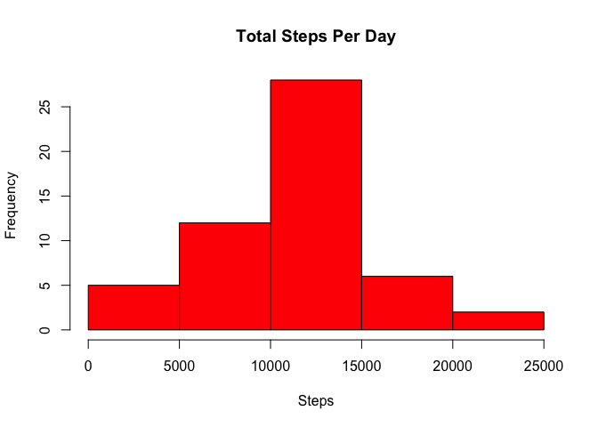
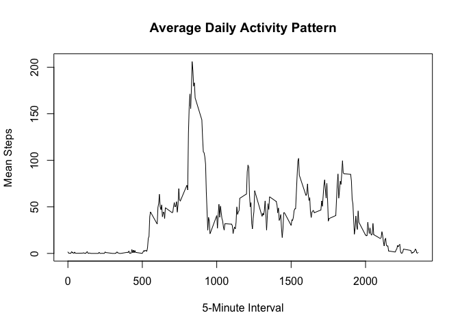
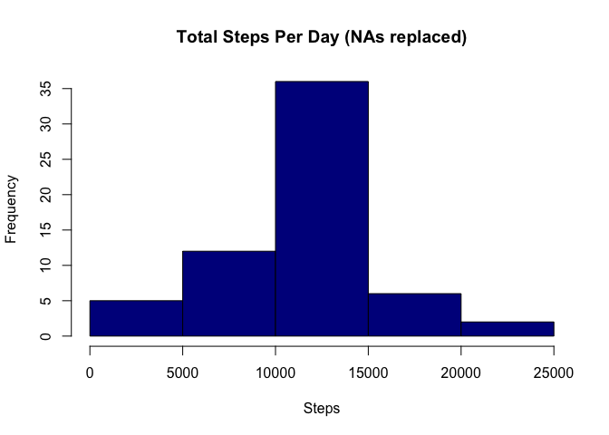
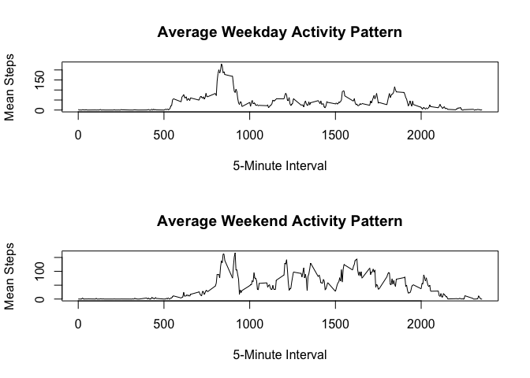

# Reproducible Research: Peer Assessment 1
## Loading and preprocessing the data

```r
library(knitr)
opts_chunk$set(echo = TRUE, results='asis')
```

```r
activity <- read.csv("activity.csv", colClass=(c("numeric", "Date", "numeric")), na.strings="NA")
```

## What is mean total number of steps taken per day?

Here is a histogram of the total number of steps per day.

```r
library(dplyr)
```

```
## 
## Attaching package: 'dplyr'
```

```
## The following object is masked from 'package:stats':
## 
##     filter
```

```
## The following objects are masked from 'package:base':
## 
##     intersect, setdiff, setequal, union
```

```r
act_day <- group_by(activity, date)
act_totals <- summarize(act_day, total_steps=sum(steps))
hist(act_totals$total_steps, main="Total Steps Per Day", xlab="Steps", col=c("red"))
```



Here is the mean total number of steps taken per day.

```r
mean(act_totals$total_steps, na.rm=TRUE)
```

[1] 10766.19

Here is the median total number of steps taken per day.

```r
median(act_totals$total_steps, na.rm=TRUE)
```

[1] 10765

## What is the average daily activity pattern?


```r
act_int <- group_by(activity, interval)
act_avg <- summarize(act_int, mean_steps=mean(steps, na.rm=TRUE))
plot(act_avg$interval, act_avg$mean_steps, type="l", main="Average Daily Activity Pattern", xlab="5-Minute Interval", 
     ylab="Mean Steps")
```



The 5-minute interval, averaged across days, that contains the highest number of steps is:

```r
max <- filter(act_avg, mean_steps==max(act_avg$mean_steps))
max
```

Source: local data frame [1 x 2]

  interval mean_steps
1      835   206.1698

## Imputing missing values
The number of missing values is:

```r
sum(is.na(activity$steps))
```

[1] 2304


This code replaces the missing values with the average for each interval.

```r
library(data.table)
```

```
## 
## Attaching package: 'data.table'
```

```
## The following objects are masked from 'package:dplyr':
## 
##     between, last
```

```r
impute.mean <- function(x) replace(x, is.na(x), mean(x, na.rm=TRUE))
setDT(activity)
replaced <- activity[,steps := impute.mean(steps), by = interval]
```

Here is a histogram of the total number of steps per day with the missing values filled in.

```r
rep_day <- group_by(replaced, date)
rep_totals <- summarize(rep_day, total_steps=sum(steps))
hist(rep_totals$total_steps, main="Total Steps Per Day (NAs replaced)", xlab="Steps", col=c("darkblue"))
```



Here is the mean total number of steps taken per day with the missing values filled in.

```r
mean(rep_totals$total_steps)
```

[1] 10766.19

Here is the median total number of steps taken per day with the missing values filled in.

```r
median(rep_totals$total_steps)
```

[1] 10766.19


Yes, replacing the missing values does have an effect on the data. The columns in the replaced histogram are a little taller because now they have more data to count and the mean and median are the same in the new histogram.

## Are there differences in activity patterns between weekdays and weekends?


```r
Weekdays <- c("Monday", "Tuesday", "Wednesday", "Thursday", "Friday")
activity$day <- factor((weekdays(activity$date) %in% Weekdays), levels=c(FALSE, TRUE), labels=c('weekend', 'weekday'))

wkday <- filter(activity, day=="weekday")
wkend <- filter(activity, day=="weekend")
intwkday <- group_by(wkday, interval)
intwkend <- group_by(wkend, interval)
wkdayavg <- summarize(intwkday, mean_steps=mean(steps, na.rm=TRUE))
wkendavg <- summarize(intwkend, mean_steps=mean(steps, na.rm=TRUE))
par(mfrow=c(2,1))
plot(wkdayavg$interval, wkdayavg$mean_steps, type="l", main="Average Weekday Activity Pattern", 
     xlab="5-Minute Interval", ylab="Mean Steps")
plot(wkendavg$interval, wkendavg$mean_steps, type="l", main="Average Weekend Activity Pattern", 
     xlab="5-Minute Interval", ylab="Mean Steps")
```


